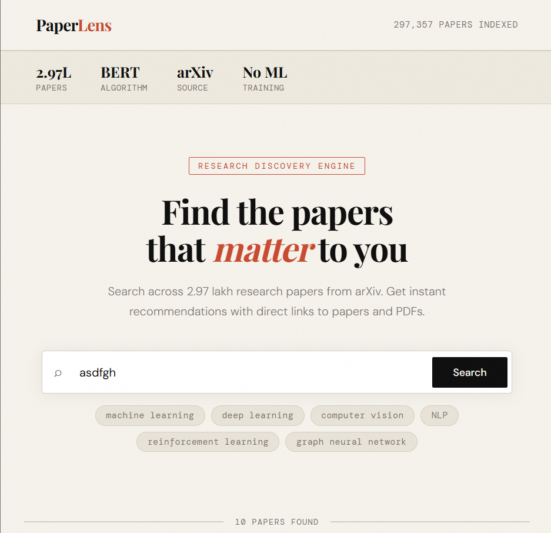
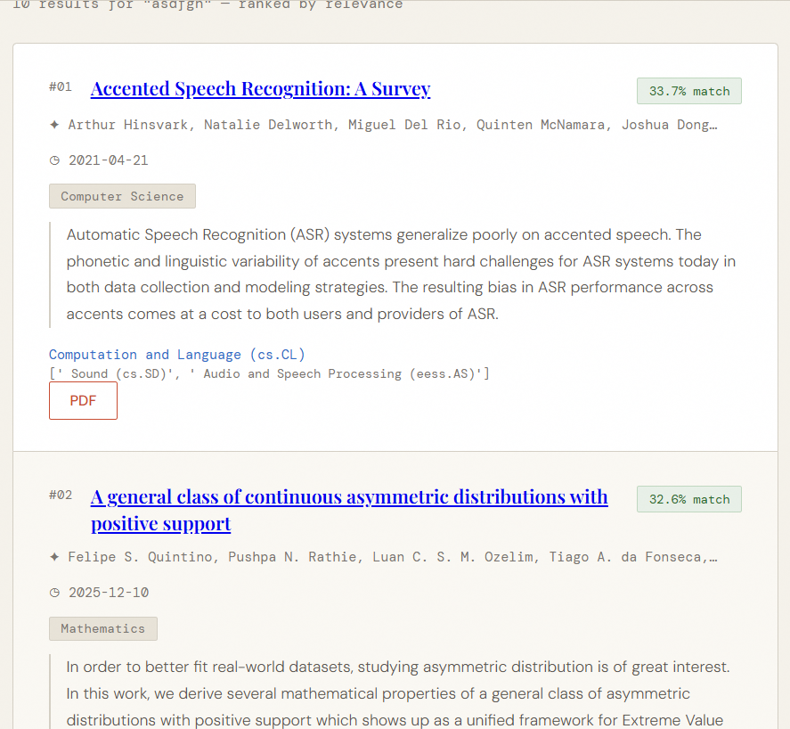

# 📚 PaperLens – Research Paper Recommendation System using BERT
🚀 **Live Demo:** https://v-sriram-paperlens.hf.space/

PaperLens is an AI-powered research paper recommendation system that uses **BERT sentence embeddings** and **FAISS vector search** to retrieve semantically relevant research papers from the **arXiv dataset**.

Unlike traditional keyword search, PaperLens understands the meaning of a query and efficiently retrieves the most relevant papers using semantic vector search.


---

# 🚀 Features

- 🔍 Semantic search using BERT embeddings
- ⚡ High-speed retrieval using FAISS vector search
- 🤖 Sentence Transformers (all-MiniLM-L6-v2)
- 📄 Top-10 research paper recommendations
- 📚 Search across **297,357** arXiv research papers
- ⚡ FastAPI REST API
- 🎨 Responsive HTML/CSS/JavaScript frontend
- 💾 SQLite database
- 🌐 Public deployment on Hugging Face Spaces
- Dataset containing **297,357 arXiv research papers**

---

# 🛠️ Tech Stack

## Backend
- Python
- FastAPI

## Machine Learning
- Sentence Transformers
- BERT (all-MiniLM-L6-v2)
- FAISS
- NumPy
- Pandas

## Database
- SQLite

## Frontend
- HTML
- CSS
- JavaScript

---

# 📂 Project Structure

```
PaperLens/
│
├── app.py
├── recommender.py
├── preprocessing.py
├── etl_warehouse.py
├── requirements.txt
│
├── templates/
│   └── index.html
│
├── models/
│   ├── paper_index.faiss
│   └── papers_df.pkl
│
├── data/
│   ├── papers_clean.csv
│   ├── raw_dataset.csv
│   └── papers_warehouse.db
│
└── README.md
```

---

# ⚙️ How It Works

1. User enters a research topic.
2. Query is cleaned and encoded using Sentence Transformers.
3. The embedding is normalized.
4. FAISS performs a nearest-neighbor vector search.
5. Top-10 most relevant papers are retrieved.
6. Results are displayed with metadata and links.

---

# 🧠 Recommendation Pipeline

```
User Query
      │
      ▼
Sentence Transformer (BERT)
      │
      ▼
Query Embedding
      │
      ▼
FAISS Vector Search
      │
      ▼
Top-K Similar Papers
      │
      ▼
FastAPI Backend
      │
      ▼
Web Interface
```

---

# 📦 Installation

Clone the repository

```bash
git clone https://github.com/SRIRAM2126/PaperLens.git
```

Move into the project

```bash
cd PaperLens
```

Install dependencies

```bash
pip install -r requirements.txt
```

Run the application

```bash
python -m uvicorn app:app --reload
```

Open

```
http://127.0.0.1:8000
```

---
# 🌐 Live Demo

https://v-sriram-paperlens.hf.space/

Hosted using Hugging Face Spaces.

# 📈 Dataset

- Source: arXiv
- Total Papers: **297,357**
- Storage: SQLite
- Search Index: FAISS
- Embedding Model: all-MiniLM-L6-v2

---

# 📊 Machine Learning Model

### Embedding Model

```text
sentence-transformers/all-MiniLM-L6-v2
```

### Vector Search Engine

```text
FAISS (Facebook AI Similarity Search)
```

### Similarity Metric

```text
Cosine similarity over normalized embeddings using FAISS
```

---

# 🎯 Future Improvements

- PDF summarization using LLMs
- Personalized recommendations
- User authentication
- Search filters
- Research paper bookmarking
- Citation graph visualization
- Multi-model embedding support

---
# ⚡ Performance

- Dataset Size: 297,357 Papers
- Embedding Dimension: 384
- Search Engine: FAISS
- Top Results Returned: 10
- Deployment: Hugging Face Spaces

# 📸 Screenshots

## Home Page



## Search Results



## Mobile View


# 👨‍💻 Author

**Vadthyavath Sriram**
**Kartavya Gupta**

B.Tech Student | AI Engineer |  Machine Learning Enthusiast

---

# ⭐ If you like this project

Please give it a ⭐ on GitHub.